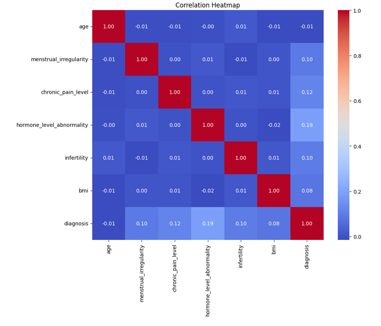
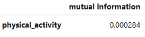
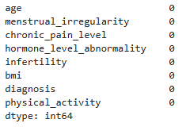

# Problem description

Endometriosis is a chronic gynecological condition characterized by the growth of endometrial-like tissue outside the uterus, leading to symptoms such as pelvic pain, infertility, and reduced quality of life. Despite affecting an estimated 10% of women of reproductive age worldwide, endometriosis is often underdiagnosed or diagnosed after significant delays, primarily due to the non-specific nature of its symptoms and the need for invasive procedures like laparoscopy for definitive diagnosis. Early and accurate prediction of endometriosis is crucial for timely intervention, improved patient outcomes, and reduced healthcare costs. 


Leveraging machine learning (ML) techniques to predict endometriosis based on clinical and demographic data offers the potential to enhance diagnostic accuracy, minimize invasive procedures, and support personalized treatment strategies.

# Dataset description
The dataset used is taken from Kaggle 
 ```
 https://www.kaggle.com/datasets/michaelanietie/endometriosis-dataset?resource=download
 ````
It is structured to reflect common features and symptoms associated with the condition, making it suitable for training machine learning models. I have additionally created a text variable physical_activity in order to practise mutual information and DictVectorizer.

# EDA Summary

After exploratory analysis and checking the correlation "age" variable has been deleted as it has no correlation with the target variable - endometriosis diagnosis.



Mutual information showed that physical activity can explain the target variable rather minimally.



Exploratory analysis revealed no outliers and no nulls. The target variable is balanced.





# Model Training

The following models were used to train the model with the ROC_AUC scores on the test data:

| Model                   | ROC_AUC |
|-------------------------|---------|
| LogisticRegression      | 0.644   |
| DecisionTreeClassifier  | 0.642   |
| RandomForestClassifier  | 0.656   |
| XGBoost                 | 0.653   |


The hyperparameters in the models were tuned to achieve the highest ROC_AUC score. As a result Random Forest with max depth of 10 and min samples leaf of 50 is chosen to train the final model.

# Deployment

To install all the dependencies, run:

```
uv sync
```

To run the model locally, execute the following code in the terminal:

```
uv run python predict.py
```

You can then test the Webservice either by going to http://localhost:9696/docs or executing the following curl command:

```
curl -X 'POST' \
  'http://localhost:9696/predict' \
  -H 'accept: application/json' \
  -H 'Content-Type: application/json' \
  -d '{
  "menstrual_irregularity": 1,
  "chronic_pain_level": 3.43688,
  "hormone_level_abnormality": 1,
  "infertility": 0,
  "bmi": 27.237861,
  "physical_activity": "rarely"
}'
```

# Docker

To run a containerized app

```
docker build -t attrition-prediction .
docker run -it --rm -p 9696:9696 attrition-prediction
```

And similarly test the Webservice either by going to http://localhost:9696/docs or executing the following curl command:

```
curl -X 'POST' \
  'http://localhost:9696/predict' \
  -H 'accept: application/json' \
  -H 'Content-Type: application/json' \
  -d '{
  "menstrual_irregularity": 1,
  "chronic_pain_level": 3.43688,
  "hormone_level_abnormality": 1,
  "infertility": 0,
  "bmi": 27.237861,
  "physical_activity": "rarely"
}'
```

# Cloud deployment

The app was deployed on Render. 

To test run the following curl command on https://endometriosis-prediction.onrender.com/docs:

```
curl -X 'POST' \
  'https://endometriosis-prediction.onrender.com/predict' \
  -H 'accept: application/json' \
  -H 'Content-Type: application/json' \
  -d '{  "menstrual_irregularity": 1,
  "chronic_pain_level": 3.43688,
  "hormone_level_abnormality": 1,
  "infertility": 0,
  "bmi": 27.237861,
  "physical_activity": "rarely"}'
  ```
